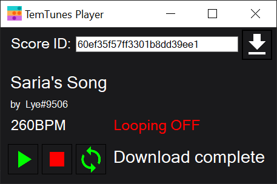

# TemTunes Player (Download link below)

The TemTunes Player is a macro player designed to read JSON files generated by the [temtunes.org](https://temtunes.org) composer. 
The player generates sequences of keyboard numeric key presses that match the required input to play the selected tune on the in-game Piano
emote. 

### Disclaimer

The use of macros in Temtem has been approved for the Piano emote/toy. **NO OTHER PURPOSES ARE PERMITTED AT THIS TIME!** 
I will not accept any blame for you using this player to macro any other activity. It's just for the piano and just for playing music.
Anything else and the consequences are your own damned fault.

### Requirements

The TemTunes Player requires the .NET Framework version 4.7.2 which can be found [HERE](https://dotnet.microsoft.com/download/dotnet-framework/net472).

### Operation

##### Step 1: Retrieving the score
In order to download a score, go to [temtunes.org](https://temtunes.org) and find a score that is to your liking, then press the light-blue copy button,
or copy the sequence of letters and numbers in the url following ?scoreId=. Copy this value into the text field in the player and press the white 
download button on the side. Upon a successful download, the fields below will display information on the tune, and the info label in the bottom right
corner will show the status "Download complete"

##### Step 2: Play the tune

Make sure you're logged into the game and have your Piano at the ready. Once you are ready, press the play button and switch back to Temtem. 
TemTunes Player tunes start playing **after a delay of 3 seconds.** This delay server to ensure you are ready and Temtem is your focused application.
You will know the player has started playing when the info label in the bottom right corner shows the status "Playing"

##### Stopping a tune

In order to stop a tune, simply click on the stop button in the TemTunes Player. The tune has stopped playing once the info label in the bottom
right corner displays the status "Stopped"
**IMPORTANT: Do not switch to other applications until the player is stopped as it will continue producing key presses no matter what 
application is focused and may produce undesirable results**

### Known limitations

##### Unity input processing

Unity processes inputs during updates which happen every frame. As a result of this, any inputs that happen at speeds exceeding 1 frame
may be skipped by Unity. This includes actions such as releasing a key on fast, sequential notes, where the lack of release can cause
notes to register as a single long note. To get around this, TemTunes Player reduces the duration of each note by 20ms, allowing for a frame
to pass at slightly below 60FPS (60FPS = \~16.6ms/frame) between the release of a tone being played and the next possible occurence of that 
tone being played. At lower BPM the resulting shortening is insignificant. At higher BPM such as 400 BPM (\~150ms/beat) this shortening is more pronounced 
(\~13.3% @ 400BPM) but still generally not very noticable. 

An unfortunate result of this is that players playing at significantly below 60FPS may find that certain scores are not played correctly.

##### Maximum tone duration

Right now the Piano emote has a maximum duration for a note/tone that is somewhere in the ballpark of 1 second. The TemTunes player does
not take this maximum duration into account when reproducing a score. Score authors should take care when creating a score that their
scores actually be playable.

### Download

##### TODO